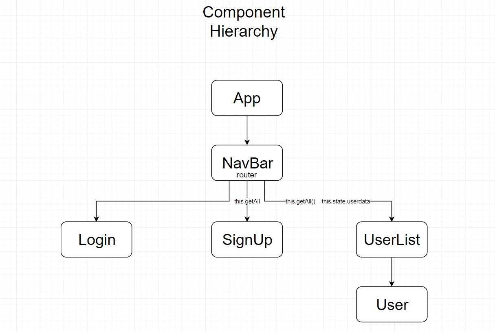

# React Assessment Documentation

### Quick Links:
* [Wireframes](#wireframes)
   * [Sign Up Page](#signup)
   * [Login Page](#login)
   * [User Page](#user)
   
* [Component Hierarchy](#hierarchy)

 

 

## Wireframes

### Sign Up Page

### Login Page

### User List Page

## Component Hierarchy

